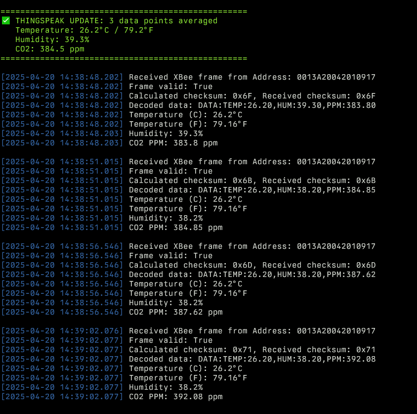

# Building an Advanced Air Quality Monitoring System with MicroPython

This project combines gas detection with temperature and humidity monitoring. The goal is to create a reliable, low-cost system for monitoring indoor air quality using off-the-shelf components. I chose the MQ135 gas sensor for its ability to detect a wide range of gases, including CO2, and the DHT22 for accurate temperature and humidity readings. The system is built around a MicroPython-capable microcontroller (RP2350) and uses XBee modules for wireless communication.

## Components

For this project, I used:

- 2x MQ135 gas sensor for CO2 and other gas detection
- 2x DHT22 sensor for temperature and humidity readings
- 3x XBee modules for wireless communication
- 2x MicroPython-capable microcontroller (RP2350)


## Challenges with Gas Sensor Accuracy

One of the biggest challenges I faced was getting reliable readings from the MQ135 gas sensor. These sensors are sensitive to environmental factors, particularly temperature and humidity. RZERO values drift as the sensor ages and the standard libraries available don't account for these variables leading to inaccurate PPM (parts per million) calculations.

To solve this problem, I implemented a temperature and humidity compensation algorithm. This required:

1. Calculating a correction factor based on current conditions
2. Applying this correction to both resistance readings and PPM calculations
3. Implementing a moving average for calibration stability

```python
def _get_correction_factor(self, temperature, humidity):
    """Calculates the correction factor for ambient air temperature and relative humidity"""
    if temperature < 20:
        return self.CORA * temperature * temperature - self.CORB * temperature + self.CORC - (humidity - 33.) * self.CORD
    return self.CORE * temperature + self.CORF * humidity + self.CORG
```

This function calculates how much we need to adjust our readings based on current environmental conditions, significantly improving accuracy.

## Building a Robust Sensor Monitoring System

Reliability is critical for environmental monitoring systems. I designed my code with several features to ensure consistent operation:

1. **Oversampling** - Multiple readings are taken and averaged to reduce noise
2. **Error handling** - The system detects and recovers from temporary sensor failures (e.g., rail conditions)
3. **Calibration management** - Dynamic RZERO calibration with a moving average window

```python
def read_raw(self):
    """Read raw ADC value with oversampling and offset compensation"""
    sum_value = 0
    valid_samples = 0
    
    for _ in range(self.oversample):
        value = self.adc.read_u16()
        
        # Skip rail conditions
        if value == 0 or value == self.ADC_MAX:
            continue
            
        # Subtract offset and check for valid range
        compensated = value - self.adc_offset
        if compensated < 0:
            compensated = 0
        elif compensated > self.ADC_MAX:
            compensated = self.ADC_MAX
            
        sum_value += compensated
        valid_samples += 1
            
    if valid_samples == 0:
        # Fall back to a single raw reading if no valid samples
        return self.adc.read_u16()
        
    return sum_value // valid_samples
```

See the above function for handling of ADC errors and oversampling strategy to improve read stability.

## Wireless Communication with XBee

For remote monitoring capability, I integrated XBee wireless modules using the API mode. This allows for more reliable data transmission with acknowledgment and retries.

The most challenging aspect was constructing proper API frames with correct checksums and escape sequences. I created a dedicated `APISend` class to handle this complexity:

```python
def _create_api_frame(self, frame_type, frame_data):
    """Create a complete API frame with proper structure"""
    # Create frame data starting with the frame type
    frame_type = int(frame_type)
    
    # Ensure frame_data is a bytearray
    if not isinstance(frame_data, bytearray):
        frame_data = bytearray(frame_data)
    
    data = bytearray([frame_type]) + frame_data
    
    # Calculate length (API data length)
    length = len(data)
    
    # Calculate checksum
    checksum = self._calculate_checksum(data)
    
    # Create the complete frame
    frame = bytearray([self.START_DELIMITER])  # Start delimiter
    frame.extend([length >> 8, length & 0xFF])  # Length (MSB, LSB)
    frame.extend(data)  # Frame data (includes frame type)
    frame.append(checksum)  # Checksum
    
    return frame
```

This ensures our data packets are properly formatted for reliable transmission.

## Bringing It All Together

The final step was creating a unified `Node` class that integrates all components. This class handles:

- Regular sampling of all sensors
- Data processing and correction
- Transmission of results
- Diagnostic reporting

```python
def continuous_monitoring(self, update_interval=2, use_dht=True, transmit=False, xbee=None):
    """Continuously monitor and print sensor values, optionally transmit data"""
    if transmit and xbee is None:
        raise ValueError("XBee object required for transmission")
        
    try:
        while True:
            if use_dht:
                self.update_environment_data()
            
            values = self.read_mq135_values()
            self.print_sensor_data()
            
            if transmit and xbee:
                # Send data over XBee
                temperature = self.temperature
                humidity = self.humidity
                corrected_ppm = values['corrected_ppm']
                xbee.send_sensor_data(temperature, humidity, corrected_ppm)
                
            time.sleep(update_interval)
            
    except KeyboardInterrupt:
        print("Monitoring stopped")
```

The main loop above demonstrates how the system continuously monitors conditions and optionally transmits data wirelessly.

## Results and Future Improvements




Future Improments include:

1. Add support for additional sensors (e.g., PM2.5, VOC, lightning, etc.)
2. Implement data logging to SD card for offline analysis
3. Add support for multiple sensor nodes in a mesh network
4. Create adjustable alert thresholds for different gas concentrations
5. Send data to AWS IoT Core for cloud storage and analysis
6. Local Grafana dashboard for real-time monitoring
7. Implement MQTT protocol for more flexible communication

This project demonstrates how MicroPython enables sophisticated environmental monitoring with affordable components. The full code is available in my GitHub repository.

[Micropython Air Quality Monitoring](www.github.com/adstanley/micropython-air-quality-monitoring)